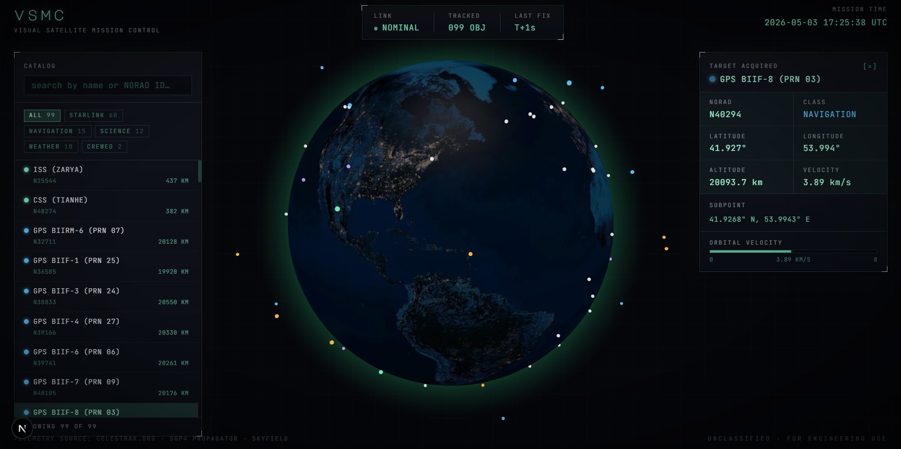

# VSMC // Visual Satellite Mission Control

> A live, full-stack 3D satellite tracker. Pulls real orbital data from CelesTrak, propagates with SGP4, and renders ~100 spacecraft on a 3D Earth in your browser — updating every 3 seconds.

🌐 **Live demo:** https://visual-satellite-mission-control.vercel.app/



---

## What it does

VSMC tracks a curated set of ~100 real satellites — including the ISS, Tiangong, GPS, weather satellites (NOAA, GOES, METEOSAT), Earth-observation missions (Landsat, Sentinel, Aqua, Terra), Hubble, and a sample of Starlink — and visualises them on a 3D Earth in real time.

- Click any satellite, on the globe or in the searchable catalog, to see live telemetry: latitude, longitude, altitude, velocity, and orbital subpoint.
- Filter by category. Search by name or NORAD ID.
- Auto-rotating Earth that pauses on interaction. Phosphor-green mission-control aesthetic with CRT scanline overlay.
- The position values are **really computed** at request time using the SGP4 orbital propagator via Skyfield — not faked, not pre-baked.

## Architecture

```
Browser ──── HTTPS ────►  Next.js 15 (Vercel)
                              │
                              │ fetch /api/satellites/positions
                              ▼
                          FastAPI (Render)
                              │
                              │ Skyfield (SGP4) propagator
                              ▼
                          CelesTrak TLE feed
                          (cached 6h, refreshed on demand)
```

| Layer | Tech | Why |
|---|---|---|
| Frontend | Next.js 15, TypeScript, Tailwind | App router, free Vercel hosting, type safety end-to-end |
| 3D Earth | react-globe.gl (Three.js) | Battle-tested wrapper made for exactly this use case |
| Fonts | JetBrains Mono + Major Mono Display | Mono = data-readout aesthetic; display = brand wordmark |
| Backend | FastAPI + Skyfield | Async + free OpenAPI docs; Skyfield handles time scales & WGS84 properly |
| Data | CelesTrak TLE feeds | Free, authoritative, no auth needed |
| Resilience | Multi-source fetch + bundled fallback | Backend keeps working even if CelesTrak is briefly unreachable |
| Hosting | Vercel + Render | Both have generous free tiers; auto-deploy on git push |

## Project structure

```
vsmc/
├── backend/                  FastAPI service
│   ├── app/
│   │   ├── api/              REST routes
│   │   ├── core/             TLE loader, SGP4 propagator
│   │   └── models/           Pydantic schemas
│   ├── tests/                16 unit + integration tests
│   ├── Dockerfile
│   ├── requirements.txt
│   └── pyproject.toml
├── frontend/                 Next.js app
│   ├── app/                  Pages + global styles
│   ├── components/           Globe, panels, top bar
│   └── lib/                  Typed API client + category metadata
├── render.yaml               Render blueprint (one-click backend deploy)
└── README.md
```

## Run it locally

You'll need **Python 3.11+** and **Node 18+**.

### Backend

```bash
cd backend
python -m venv .venv && source .venv/bin/activate     # Windows: .venv\Scripts\Activate.ps1
pip install -e ".[dev]"
pytest -v                                              # 16 tests should pass
uvicorn app.main:app --reload
```

API docs at <http://127.0.0.1:8000/docs>.

### Frontend

In a second terminal:

```bash
cd frontend
npm install
npm run dev
```

App at <http://localhost:3000>.

## Highlights

- **Real orbital math.** Skyfield propagates each satellite's TLE with SGP4, then converts ECI → WGS84 geodetic coordinates correctly. Cross-check positions against [N2YO](https://www.n2yo.com/) — they match.
- **Resilient data layer.** Tries 7 CelesTrak feeds in sequence, dedupes by NORAD ID, and falls back to a bundled snapshot if every live source fails. The app always renders.
- **Mission-control UI, not a dashboard.** Custom CSS for scanlines, vignette, bracketed panels, blinking status indicators, live UTC clock, phosphor-green readouts. Mono typography end-to-end.
- **Type-safe end-to-end.** Pydantic schemas on the backend, matching TypeScript interfaces on the frontend. Change one, the other complains.
- **Tested.** 16 backend tests covering parsing, curation, cache concurrency, propagation sanity, and full HTTP layer with the network stubbed out.

## Limitations & honest notes

- ~100 satellites is the curated cap, not a hard limit. The frontend can comfortably render 500–1000; we kept it tight for clarity.
- Render's free tier sleeps after 15 min of no traffic. The first visitor sees a "Establishing uplink…" status for ~30s while the backend wakes up. The frontend handles this with retries + backoff.
- CelesTrak's bot protection occasionally blocks programmatic access. We work around this by using the redirect-style URLs that their server emits.

## License

MIT.
